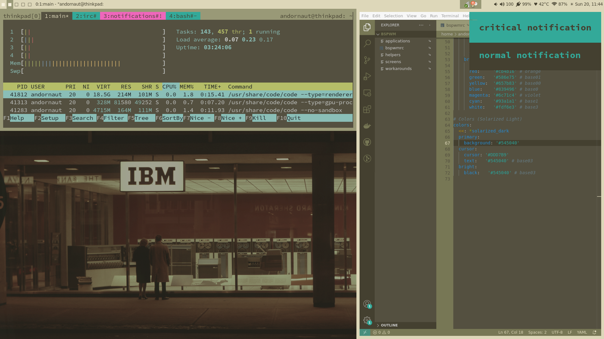

# IBM1970 Desktop Theme

An IBM and 1970s inspired desktop theme.



This theme is implemented as several distinct yet coordinated customizations of Linux and macOS applications.

Example usage: [andornaut/dotfiles#6c947f3](https://github.com/andornaut/dotfiles/tree/6c947f387d15abe662ddef630ce28c866250c254)

## Wallpaper

[A photograph of an IBM Data Center](http://ibm-1401.info/IBM1401_ArchivePics.html) by George Dunbar who was a photographer for IBM Canada from 1957 to 1989.

* [Original](http://ibm-1401.info/Toronto-KingSt-Datacenter-1.jpg)
* [16x10](./wallpaper/ibm1970-16x10.png)
* [21x9](./wallpaper/ibm1970-21x9.png)

## Alacritty

[Alacritty](https://github.com/alacritty/alacritty) is a cross-platform terminal emulator.

* [alacritty.yml](https://github.com/andornaut/dotfiles/blob/6c947f387d15abe662ddef630ce28c866250c254/%24HOME/.config/alacritty/alacritty.yml#L63)

## bspwm

[bspwm](https://github.com/baskerville/bspwm) is a tiling window manager.

* [bspwmrc](https://github.com/andornaut/dotfiles/blob/6c947f387d15abe662ddef630ce28c866250c254/%24HOME/.config/bspwm/bspwmrc#L30)

## Dunst

[Dunst](https://github.com/dunst-project/dunst) is a notification daemon.

* [dunstrc](https://github.com/andornaut/dotfiles/blob/6c947f387d15abe662ddef630ce28c866250c254/%24HOME/.config/dunst/dunstrc#L248)

## Home Assistant

[Home Assistant](https://www.home-assistant.io/) is an automation platform.

* [themes/ibm1970.yaml](https://github.com/andornaut/homeassistant-ibm1970-theme)

## iterm2

[iTerm2](https://iterm2.com/) is a terminal emulator for macOS.

* [ibm1970.itermcolors](./iterm2/ibm1970.itermcolors)

## lemonbar

[lemonbar](https://github.com/LemonBoy/bar) is a desktop bar.

* [bbsrc](https://github.com/andornaut/dotfiles/blob/6c947f387d15abe662ddef630ce28c866250c254/%24HOME/.config/bbs/bbsrc#L3) - bbs provides scripts to customize lemonbar

## macOS menubar

1. Install [ChangeMenuBarColor](https://github.com/igorkulman/ChangeMenuBarColor)
1. ```ChangeMenuBarColor SolidColor 9c9977 --all-displays```

## Rofi

[Rofi](https://github.com/davatorium/rofi) is an application launcher and window switcher.

* [rofi/config](https://github.com/andornaut/dotfiles/blob/6c947f387d15abe662ddef630ce28c866250c254/%24HOME/.config/rofi/config#L38)

## tmux

[tmux](https://github.com/tmux/tmux/wiki) is a terminal multiplexer.

* [.tmux.conf](https://github.com/andornaut/dotfiles/blob/6c947f387d15abe662ddef630ce28c866250c254/%24HOME/.tmux.conf#L91)

## vim

[vim](https://www.vim.org/) is a text editor.

* [.vimrc](https://github.com/andornaut/dotfiles/blob/6c947f387d15abe662ddef630ce28c866250c254/%24HOME/.vimrc#L14)

## Visual Studio Code

[Visual Studio Code](https://code.visualstudio.com/) is a code editor.

* [vscode-ibm1970-theme](https://github.com/andornaut/vscode-ibm1970-theme)
